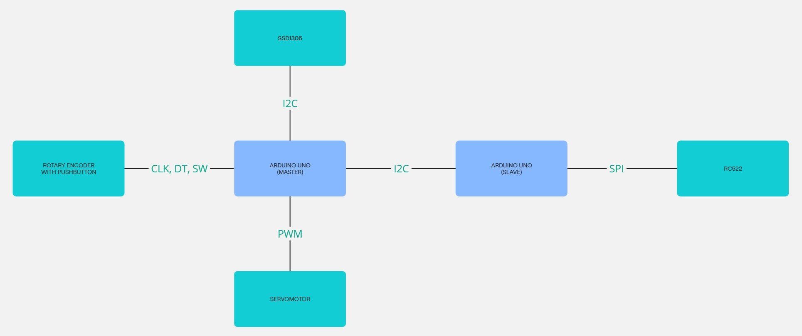
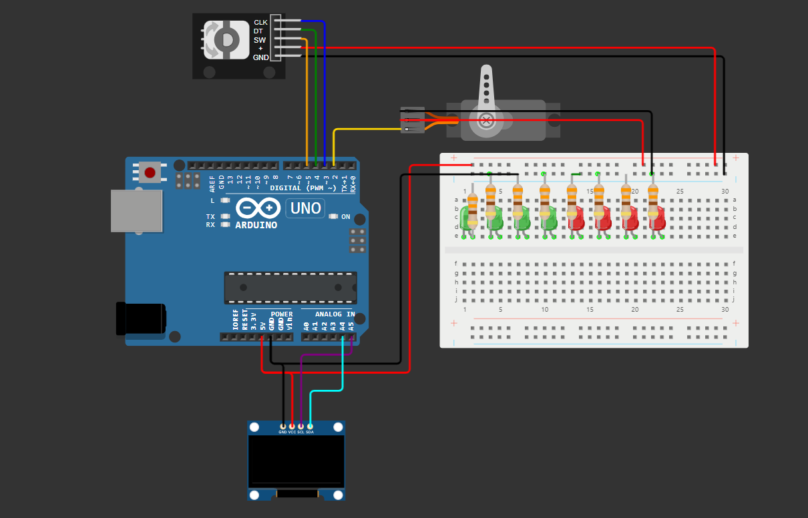
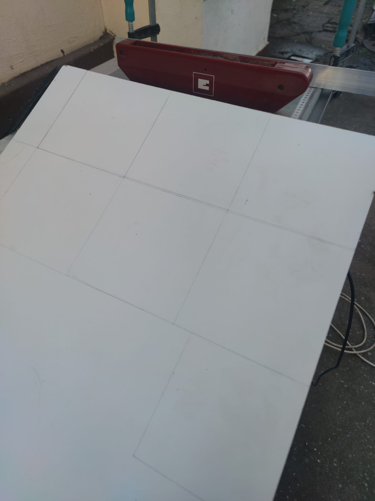
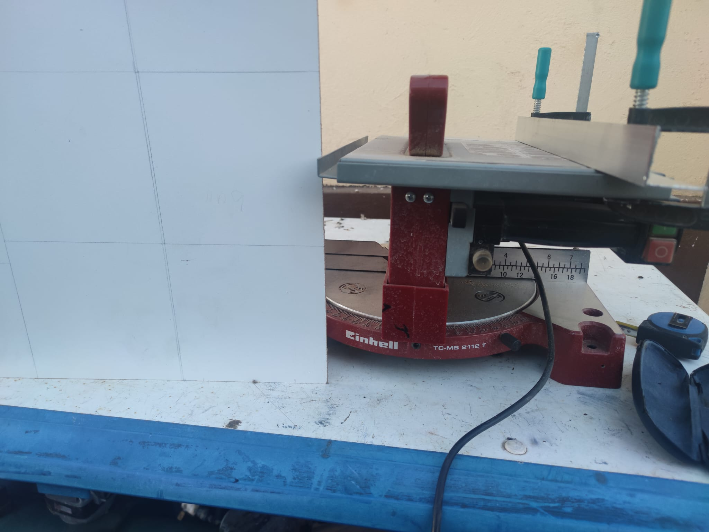

# DIY Safe Box  

---
<details>
   <summary>Introduction</summary>
   
# Introduction  

**Project Name:** DIY Safe Box 

**Functionality:**  
An interactive safe that allows the user to guess a numeric combination displayed on a screen. Once the correct value is entered, a servo motor unlocks the safe mechanism. RFID cards can also be used for access.  

**Purpose:**  
To develop a simple security device based on knowledge of electronics, programming, and communication protocols.  

**Inspiration:**  
I wanted to make a safe and then I found a game made by someone and I wanted to do the same thing, but on my own. I will attach the video in the Resources paragraph.  

**Usefulness:**  
- **For me:** Practical understanding of protocols and hardware components.  
- **For others:** Inspiration for similar projects, use as an educational device, or as a game.  


**Block Diagram:**  




All components interact through the master microcontroller, which handles the application logic and communication with the slave microcontroller for RFID access validation.

</details>

---

<details>
   <summary>Hardware Design</summary>
   
# Hardware Design  

<details>
   <summary>Bill of Materials</summary>
   
## Bill of Materials: 
| **Components**| **Quantity** | **Description** | **Datasheet** | **Source/Link** |
|---------------|--------------|-----------------|---------------|-----------------|
| Arduino Uno Microcontroller | 2 | The master coordinates the operation of components by managing I2C communication, PWM, and interrupts. The slave handles the RFID reader and communicates the access status to the master via I2C. | [Link to datasheet and more](https://docs.arduino.cc/hardware/uno-rev3/) | Personal kit and faculty kit. |
| OLED Display SSD1306 | 1 | Displays the guessed combination and status messages. |[SSD1306 datasheet](https://cdn-shop.adafruit.com/datasheets/SSD1306.pdf) | [SSD1306](https://www.emag.ro/afisaj-oled-ssd1306-oled-i2c-compatibil-arduino-si-raspberry-pi-27x27x4-mm-albastru-c9/pd/D3C7C1YBM/?ref=history-shopping_405308918_158626_1) | 
| Rotary Encoder with Pushbutton KY-040 | 1 | It's used to change the digits that are guessed and to submit the answers. It also restarts the game. | [KY-040 datasheet](https://www.rcscomponents.kiev.ua/datasheets/ky-040-datasheet.pdf?srsltid=AfmBOoowfQPDwyjgYCvvT0xByS4xcktQgP5ZGPhLJJ2l2TtwWTf65FRt) | [Rotary Encoder w Pushbutton](https://www.emag.ro/modul-encoder-rotativ-cu-buton-rosfix-360-grade-20-impulsuri-rotire-26x19mm-pzxo-cq39/pd/DYC8PSYBM/?ref=history-shopping_405308918_186146_1) |
| LEDs | 8 | For feedback on guesses as well as a little display of lights. | N/A | Personal kit. |  
| RFID Reader Module RC522 | 1 | It's used as the only option to open the safe withouth guessing the code. | [RC522 NXP datasheet](https://www.nxp.com/docs/en/data-sheet/MFRC522.pdf) | [RC522](https://www.optimusdigital.ro/en/wireless-rfid/67-mfrc522-rfid-module.html?search_query=rfid&results=30)  
| Servo Motor SG90 | 1| Locks and unlocks the safe. | [SG90](https://www.friendlywire.com/projects/ne555-servo-safe/SG90-datasheet.pdf) | Personal kit. |
| 330Ω Resistors| 8 | Makes sure the LEDs are working properly. | N/A | Personal kit. |  
| Jumper Wires | N/A | Connects pins to some component by using a soldering kit. | N/A | [Wires](https://www.optimusdigital.ro/ro/fire-fire-mufate/8731-cablu-12p-125-mm-mufat-la-un-singur-capat-20-cm.html?srsltid=AfmBOoqENSjVWkFWeGit2W4nyUuQcLfRHr1fEtEcQdCk4jS_TgpcTiDA)
| Breadboard | 2 | Used to connect components to a power source and ground. | N/A | Faculty kit.|  
| Power supply 4xAA Battery Support | 1 | Powers source for the components. | N/A | [Battery Support](https://www.optimusdigital.ro/ro/suporturi-de-baterii/12375-suport-baterii-4-x-aa.html?srsltid=AfmBOoofXrcJw2xVfQ2PUKit96xbxR78K6Rq58X9t2aqwo0t1SOdFPyv) 
| Switch | 1 | Turns the device on and off. | N/A | Personal item. |
</details>

<details>
   <summary>Pin Configuration</summary>

   ## Pin Configuration

   ### Master Arduino
   
   | Component            | Pins Used             |
   |----------------------|-----------------------|
   | Green LED            | 13                    |
   | Red LED              | 12                    |
   | Green LED            | 11                    |
   | Red LED              | 10                    |
   | Green LED            | 9                     |
   | Red LED              | 8                     |
   | Green LED            | 7                     |
   | Red LED              | 6                     |
   | Button               | 5                     |
   | Rotary Encoder SW    | 4                     |
   | Rotary Encoder CLK   | 3                     |
   | Rotary Encoder DT    | 3                     |
   | Servo Motor          | 2                     |
   | I2C Communication    | A5 (SCL), A4 (SDA)    |
   
### Slave Arduino

| Component            | Pins Used             |
|----------------------|-----------------------|
| RC522 SDA (SS)       | 10                    |
| RC522 SCK            | 13                    |
| RC522 MOSI           | 11                    |
| RC522 MISO           | 12                    |
| RC522 RST            | 9                     |
| I2C Communication    | A5 (SCL), A4 (SDA)    |

</details>

<details>
   <summary>Circuit</summary>

## Circuit Diagram:  

 

 

## Circuit Images:

**Signal Diagrams:**  
- **I2C Communication:** Between the master and slave microcontrollers.  
- **PWM Signal:** For servo motor control.  
- **SPI Communication:** Between the slave microcontroller and the RFID reader.  

</details>

<details>
   <summary>Circuit Design Explanation</summary>

## Master Arduino Uno R3

- It was the required microcontroller for the project.

## Slave Arduino Uno R3

- Introduced to meet the need of more pins.

## OLED Display

- Shows the digits that are guessed,messages and an animation.

## Rotary Encoder with Pushbutton

- Allows the change of digits for the guessing of the code as well as the transition between
  the guesses and the restart of the game.

## Servomotor

- Locks and unlocks the door of the safe in a simple way.

## RC522

- Unlocks the door when met with the right UID in case of a voluntary "forceful" opening of the safe.

## Switch

- Turn on and off the power for the circuit.

</details>

<details>
   <summary>Making of the box and soldering</summary>

## Making The Box

Isketched 13cm length squares on a 2mm tichness mdf board that I cut suing 2 types of saw and I made the holes using a hand drill.
The squares were attached to each other using corner guard and screws.


## Soldering

I soldered the resistors to the leds, the pin header connector to the RC522 and the wires: to the leds, between them and to a pin header connector.
I used a [plusivo soldering kit](https://www.optimusdigital.ro/ro/kituri/12919-kit-plusivo-pentru-lipit-eu-v5-cu-multimetru-digital.html?search_query=kit+ipit&results=33). 

## Images and Videos

 
 
 

https://github.com/user-attachments/assets/5cce657d-0867-4d5d-946f-a074369c622f

https://github.com/user-attachments/assets/2eda2189-a0b2-4fff-8216-217d2f586fba

https://github.com/user-attachments/assets/34359a5b-fb60-4da0-a635-136854af1eb6

https://github.com/user-attachments/assets/d5b90157-e1dc-4733-9c42-edf6bdfe2e8f

https://github.com/user-attachments/assets/34aa2c23-dc0a-4dc8-84ad-89c8b3d72968

https://github.com/user-attachments/assets/52bfb119-d22e-4f0b-9487-c9c7a0fa47c5


</details>

<details>
   <summary>Hardware Images</summary>
   
   
   
   
   
   
   
   
   
   
   
   
   
   
   
   
   
   
   
   
   
</details>

</details>

---

<details>
   <summary>Software Design</summary>
   
# Software Design  

## Description:
- **Development Environment:** Arduino IDE.

## Master Arduino:
 <details> 
    <summary>Master Arduino</summary>
    <details>
   <summary>Libraries Used</summary>
      
## Libraries Used

```
#include <Wire.h>
#include <Adafruit_GFX.h>
#include <Adafruit_SSD1306.h>
#include <Servo.h>
```

### Wire.h
- The `Wire` library is used for I2C communication. I2C (Inter-Integrated Circuit) is a protocol for communication between microcontrollers and peripheral devices. It is used to communicate with the OLED display in this project.

### Adafruit_GFX.h
- The `Adafruit_GFX` library provides a common graphics library for various displays. It includes functions for drawing shapes, text, and images on the display. This library is used to handle the graphical content displayed on the OLED screen.

### Adafruit_SSD1306.h
- The `Adafruit_SSD1306` library is specifically designed for controlling SSD1306-based OLED displays. It provides functions to initialize the display, control pixels, and render text and graphics. This library is used to interface with the OLED display in this project.

### Servo.h
- The `Servo` library is used to control servo motors. It provides functions to attach a servo motor to a specific pin, set the angle of the servo, and control its movement. In this project, the library is used to control the servo motor that locks and unlocks the safe. 
</details>   

<details>

<detials>
   <summary>Constans</summary>
   
## Constants

```
#define SCREEN_WIDTH 128
#define SCREEN_HEIGHT 32
#define OLED_RESET -1
#define SLAVE_ADDRESS 0x08

const int PIN_A = 3;
const int PIN_B = 4;
const int BUTTON_PIN = 5;
const int SERVO_UNLOCK_ANGLE =  map(50, -60, 60, 0, 180);;
const int SERVO_LOCK_ANGLE =  map(-50, -60, 60, 0, 180);
const unsigned long DEBOUNCE_TIME = 50; // Debounce time in milliseconds

const int CORRECT_NUM_LEDS[] = {13, 11, 9, 7};
const int CORRECT_PLACE_LEDS[] = {12, 10, 8, 6};
```

### SCREEN_WIDTH
- Defines the width of the OLED display in pixels. In this case, it is set to 128 pixels.

### SCREEN_HEIGHT
- Defines the height of the OLED display in pixels. In this case, it is set to 32 pixels.

### OLED_RESET
- Defines the reset pin for the OLED display. It is set to -1, indicating that no reset pin is used.

### SLAVE_ADDRESS
- Defines the I2C address of the slave device. In this case, it is set to 0x08.

### PIN_A
- Defines the pin number for the encoder's A pin. It is set to pin 3.

### PIN_B
- Defines the pin number for the encoder's B pin. It is set to pin 4.

### BUTTON_PIN
- Defines the pin number for the button. It is set to pin 5.

### SERVO_UNLOCK_ANGLE
- Defines the angle to which the servo motor should move to unlock the safe. It is calculated using the `map` function.

### SERVO_LOCK_ANGLE
- Defines the angle to which the servo motor should move to lock the safe. It is calculated using the `map` function.

### DEBOUNCE_TIME
- Defines the debounce time for the button in milliseconds. It is set to 50 milliseconds.

### CORRECT_NUM_LEDS
- Defines an array of pin numbers for the LEDs that indicate the correct number of digits in the code. The LEDs are connected to pins 13, 11, 9, and 7.

### CORRECT_PLACE_LEDS
- Defines an array of pin numbers for the LEDs that indicate the correct placement of digits in the code. The LEDs are connected to pins 12, 10, 8, and 6.
</details>

<details>
   <summary>Globals</summary>
   
## Globals

```
Adafruit_SSD1306 display(SCREEN_WIDTH, SCREEN_HEIGHT, &Wire, OLED_RESET);
Servo lockServo;

byte code[4] = {0};
byte codeGuess[4] = {0};
byte guessingDigit = 0;
byte numGuesses = 0;
volatile int encoderValue = 0;
volatile int lastAState;
volatile int updateEncoderCounter = 0;

bool isUnlocking = false;
bool isLocking = false;
bool isDisplayingMessage = false;
bool correctGuess = false;
bool oldButtonState = HIGH;
bool isDisplayingCrackedMessage = false;
bool isStartupAnimation = false;
int startupAnimationStep = 0;
unsigned long buttonPressTime = 0;
unsigned long lastActionTime = 0;
unsigned long crackedMessageStartTime = 0;

#define FRAME_DELAY (42)
#define FRAME_WIDTH (32)
#define FRAME_HEIGHT (32)
#define FRAME_COUNT (sizeof(frames) / sizeof(frames[0]))
const byte PROGMEM frames[][128] = {
  {0,0,0,0,0,0,0,0,0,0,0,0,0,0,0,0,0,14,0,0,0,19,0,0,0,17,0,0,0,17,0,0,0,17,0,0,0,17,0,0,0,17,0,0,0,17,0,0,0,17,192,0,0,17,254,0,0,17,51,192,0,17,51,32,0,17,19,32,15,16,3,48,25,144,0,48,24,208,0,48,8,112,0,48,12,48,0,48,6,16,0,48,3,0,0,48,1,128,0,48,0,192,0,32,0,96,0,32,0,48,0,96,0,12,0,64,0,7,255,128,0,0,254,0,0,0,0,0},
  {0,0,0,0,0,0,0,0,0,0,0,0,0,0,0,0,0,14,0,0,0,19,0,0,0,17,0,0,0,17,0,0,0,17,0,0,0,17,0,0,0,17,0,0,0,17,0,0,0,17,192,0,0,17,254,0,0,17,51,192,0,17,51,32,0,17,19,32,15,16,3,48,25,144,0,48,24,208,0,48,8,112,0,48,12,48,0,48,6,16,0,48,3,0,0,48,1,128,0,48,0,192,0,32,0,96,0,32,0,48,0,96,0,12,0,64,0,7,255,128,0,0,254,0,0,0,0,0},
  {0,0,0,0,0,0,0,0,0,0,0,0,0,0,0,0,0,14,0,0,0,19,0,0,0,17,0,0,0,17,0,0,0,17,0,0,0,17,0,0,0,17,0,0,0,17,0,0,0,17,192,0,0,17,254,0,0,17,51,192,0,17,51,32,0,17,19,32,15,16,3,48,25,144,0,48,24,208,0,48,8,112,0,48,12,48,0,48,6,16,0,48,3,0,0,48,1,128,0,48,0,192,0,32,0,96,0,32,0,48,0,96,0,12,0,64,0,7,255,128,0,0,254,0,0,0,0,0},
  {0,0,0,0,0,0,0,0,0,0,0,0,0,0,0,0,0,14,0,0,0,19,0,0,0,17,0,0,0,17,0,0,0,17,0,0,0,17,0,0,0,17,0,0,0,17,0,0,0,17,192,0,0,17,254,0,0,17,51,192,0,17,51,32,0,17,19,32,15,16,3,48,25,144,0,48,24,208,0,48,8,112,0,48,12,48,0,48,6,16,0,48,3,0,0,48,1,128,0,48,0,192,0,32,0,96,0,32,0,48,0,96,0,12,0,64,0,7,255,128,0,0,254,0,0,0,0,0},
  {0,0,0,0,0,0,0,0,0,0,0,0,0,0,0,0,0,14,0,0,0,19,0,0,0,17,0,0,0,17,0,0,0,17,0,0,0,17,0,0,0,17,0,0,0,17,0,0,0,17,192,0,0,17,254,0,0,17,51,192,0,17,51,32,0,17,19,32,15,16,3,48,25,144,0,48,24,208,0,48,8,112,0,48,12,48,0,48,6,16,0,48,3,0,0,48,1,128,0,48,0,192,0,32,0,96,0,32,0,48,0,96,0,12,0,64,0,7,255,128,0,0,254,0,0,0,0,0},
  {0,0,0,0,0,0,0,0,0,0,0,0,0,0,0,0,0,30,0,0,0,19,0,0,0,17,0,0,0,17,0,0,0,17,0,0,0,17,0,0,0,17,0,0,0,17,0,0,0,17,192,0,0,17,254,0,0,17,51,192,0,17,51,32,0,17,19,32,15,16,3,48,25,144,0,48,24,208,0,48,8,112,0,48,12,48,0,48,6,16,0,48,3,0,0,48,1,128,0,48,0,192,0,32,0,96,0,32,0,48,0,96,0,12,0,64,0,7,255,128,0,0,254,0,0,0,0,0},
  {0,0,0,0,0,0,0,0,0,0,0,0,0,0,0,0,0,30,0,0,0,19,0,0,0,17,0,0,0,17,0,0,0,17,0,0,0,17,0,0,0,17,0,0,0,17,0,0,0,17,192,0,0,17,254,0,0,17,51,192,0,17,51,32,0,17,19,32,15,16,3,48,25,144,0,48,24,208,0,48,8,112,0,48,12,48,0,48,6,16,0,48,3,0,0,48,1,128,0,48,0,192,0,32,0,96,0,32,0,48,0,96,0,12,0,64,0,7,255,128,0,0,254,0,0,0,0,0},
  {0,0,0,0,0,0,0,0,0,0,0,0,0,0,0,0,0,14,0,0,0,19,0,0,0,17,0,0,0,17,0,0,0,17,0,0,0,17,0,0,0,17,0,0,0,17,0,0,0,17,192,0,0,17,254,0,0,17,51,192,0,17,51,32,0,17,19,32,15,16,3,32,25,144,0,32,24,208,0,32,8,112,0,32,12,48,0,32,6,16,0,32,3,0,0,32,1,128,0,32,0,192,0,32,0,96,0,32,0,56,0,96,0,12,0,192,0,7,255,128,0,0,254,0,0,0,0,0},
  {0,0,0,0,0,0,0,0,0,0,0,0,0,0,0,0,0,12,0,0,0,31,0,0,0,17,0,0,0,17,0,0,0,17,0,0,0,17,0,0,0,17,0,0,0,17,0,0,0,17,192,0,0,17,254,0,0,17,51,192,0,17,51,32,0,17,19,32,15,16,3,32,9,144,0,32,24,208,0,32,8,112,0,32,4,48,0,32,2,16,0,32,1,0,0,32,0,128,0,32,0,64,0,32,0,32,0,32,0,24,0,96,0,12,0,192,0,7,255,128,0,0,120,0,0,0,0,0},
  {0,0,0,0,0,0,0,0,0,0,0,0,0,0,0,0,0,0,0,0,0,14,0,0,0,27,0,0,0,17,0,0,0,17,0,0,0,17,0,0,0,17,0,0,0,17,0,0,0,17,192,0,0,17,254,0,0,17,51,192,0,17,51,96,0,17,19,32,15,16,2,32,25,144,0,32,24,208,0,32,8,112,0,32,4,48,0,32,2,16,0,32,1,0,0,32,0,128,0,32,0,64,0,32,0,32,0,32,0,24,0,96,0,12,0,192,0,7,255,128,0,0,120,0,0,0,0,0},
  {0,0,0,0,0,0,0,0,0,0,0,0,0,0,0,0,0,0,0,0,0,0,0,0,0,14,0,0,0,27,0,0,0,17,0,0,0,17,0,0,0,17,0,0,0,17,0,0,0,17,192,0,0,17,254,0,0,17,51,192,0,17,51,96,0,17,19,32,15,16,2,32,9,144,0,32,24,208,0,32,12,112,0,32,6,48,0,32,2,16,0,32,1,0,0,32,0,128,0,32,0,64,0,32,0,32,0,32,0,24,0,96,0,12,0,192,0,3,255,128,0,0,120,0,0,0,0,0},
  {0,0,0,0,0,0,0,0,0,0,0,0,0,0,0,0,0,0,0,0,0,0,0,0,0,12,0,0,0,31,0,0,0,17,0,0,0,17,0,0,0,17,0,0,0,17,0,0,0,17,192,0,0,17,254,0,0,17,51,192,0,17,51,96,0,17,19,32,15,16,2,32,9,144,0,32,8,208,0,32,12,112,0,32,6,48,0,32,3,16,0,32,1,128,0,32,0,128,0,32,0,64,0,32,0,32,0,32,0,24,0,96,0,12,0,192,0,3,255,128,0,0,120,0,0,0,0,0},
  {0,0,0,0,0,0,0,0,0,0,0,0,0,0,0,0,0,0,0,0,0,0,0,0,0,14,0,0,0,30,0,0,0,17,0,0,0,17,0,0,0,17,0,0,0,17,0,0,0,17,192,0,0,17,254,0,0,17,51,192,0,17,51,96,0,17,19,32,15,16,2,32,9,144,0,32,8,208,0,32,12,112,0,32,6,48,0,32,3,16,0,32,1,128,0,32,0,128,0,32,0,64,0,32,0,32,0,32,0,24,0,64,0,12,0,192,0,3,255,128,0,0,120,0,0,0,0,0},
  {0,0,0,0,0,0,0,0,0,0,0,0,0,0,0,0,0,0,0,0,0,31,0,0,0,31,0,0,0,31,0,0,0,17,0,0,0,17,0,0,0,17,0,0,0,17,0,0,0,17,192,0,0,17,254,0,0,17,51,192,0,17,51,96,0,17,19,32,15,16,2,32,9,144,0,32,8,208,0,32,12,112,0,32,6,48,0,32,3,16,0,32,1,128,0,32,0,128,0,32,0,64,0,32,0,32,0,32,0,24,0,96,0,12,0,192,0,3,255,128,0,0,120,0,0,0,0,0},
  {0,0,0,0,0,0,0,0,0,0,0,0,0,0,0,0,0,30,0,0,0,27,0,0,0,53,128,0,0,63,128,0,0,49,128,0,0,17,0,0,0,17,0,0,0,17,0,0,0,17,192,0,0,17,254,0,0,17,51,192,0,17,51,96,0,17,19,32,15,16,2,32,9,144,0,32,8,208,0,32,12,112,0,32,6,48,0,32,3,16,0,32,1,128,0,32,0,128,0,32,0,64,0,32,0,32,0,32,0,24,0,96,0,12,0,192,0,3,255,128,0,0,120,0,0,0,0,0},
  {0,0,0,0,0,0,0,0,0,0,0,0,0,4,0,0,0,63,0,0,0,32,128,0,0,46,128,0,0,59,128,0,0,49,128,0,0,49,128,0,0,17,0,0,0,17,0,0,0,17,192,0,0,17,254,0,0,17,51,192,0,17,51,96,0,17,19,32,15,16,2,32,9,144,0,32,24,208,0,32,12,112,0,32,6,48,0,32,3,16,0,32,1,0,0,32,0,128,0,32,0,64,0,32,0,32,0,32,0,24,0,96,0,12,0,192,0,3,255,128,0,0,120,0,0,0,0,0},
  {0,0,0,0,0,0,0,0,0,0,0,0,0,31,0,0,0,33,128,0,0,96,192,0,0,78,64,0,0,91,64,0,0,81,64,0,0,49,128,0,0,49,128,0,0,17,0,0,0,17,192,0,0,17,254,0,0,17,51,192,0,17,51,96,0,17,19,32,15,16,2,32,25,144,0,32,24,208,0,32,12,112,0,32,6,48,0,32,2,16,0,32,1,0,0,32,0,128,0,32,0,64,0,32,0,32,0,32,0,24,0,96,0,12,0,192,0,3,255,128,0,0,120,0,0,0,0,0},
  {0,0,0,0,0,0,0,0,0,31,0,0,0,63,128,0,0,96,192,0,0,64,64,0,0,222,64,0,0,211,64,0,0,81,64,0,0,81,64,0,0,49,128,0,0,17,0,0,0,17,192,0,0,17,254,0,0,17,51,192,0,17,51,96,0,17,19,32,15,16,2,32,25,144,0,32,24,208,0,32,8,112,0,32,4,48,0,32,2,16,0,32,1,0,0,32,0,128,0,32,0,64,0,32,0,32,0,32,0,24,0,96,0,12,0,192,0,3,255,128,0,0,120,0,0,0,0,0},
  {0,0,0,0,0,0,0,0,0,31,0,0,0,97,192,0,0,64,64,0,0,204,96,0,0,159,32,0,0,145,32,0,0,145,96,0,0,209,64,0,0,113,192,0,0,49,128,0,0,17,192,0,0,17,254,0,0,17,51,192,0,17,51,32,0,17,19,32,15,16,3,32,25,144,0,32,24,208,0,32,8,112,0,32,4,48,0,32,2,16,0,32,1,0,0,32,0,128,0,32,0,64,0,32,0,32,0,32,0,24,0,96,0,12,0,192,0,7,255,128,0,0,120,0,0,0,0,0},
  {0,0,0,0,0,14,0,0,0,63,128,0,0,96,192,0,0,192,96,0,0,142,32,0,0,155,32,0,0,145,32,0,0,145,32,0,0,145,96,0,0,209,64,0,0,113,192,0,0,17,192,0,0,17,254,0,0,17,51,192,0,17,51,32,0,17,19,32,15,16,3,32,9,144,0,32,24,208,0,32,8,112,0,32,4,48,0,32,2,16,0,32,1,0,0,32,0,128,0,32,0,64,0,32,0,32,0,32,0,24,0,96,0,12,0,192,0,7,255,128,0,0,120,0,0,0,0,0},
  {0,0,0,0,0,31,0,0,0,113,128,0,0,192,64,0,0,128,96,0,1,142,32,0,1,147,48,0,1,17,48,0,1,145,48,0,0,145,32,0,0,209,96,0,0,113,192,0,0,49,192,0,0,17,254,0,0,17,51,192,0,17,51,32,0,17,19,32,15,16,3,32,9,144,0,32,24,208,0,32,8,112,0,32,4,48,0,32,2,16,0,32,1,0,0,32,0,128,0,32,0,64,0,32,0,32,0,32,0,24,0,96,0,12,0,192,0,7,255,128,0,0,120,0,0,0,0,0},
  {0,0,0,0,0,63,128,0,0,97,192,0,0,192,96,0,1,128,32,0,1,30,48,0,1,17,16,0,1,17,16,0,1,17,16,0,1,145,48,0,0,145,32,0,0,81,64,0,0,49,192,0,0,17,254,0,0,17,51,192,0,17,51,32,0,17,19,32,15,16,3,32,25,144,0,32,24,208,0,32,8,112,0,32,4,48,0,32,2,16,0,32,3,0,0,32,1,128,0,32,0,192,0,32,0,96,0,32,0,56,0,96,0,12,0,192,0,7,255,128,0,0,254,0,0,0,0,0},
  {0,0,0,0,0,63,128,0,0,96,192,0,0,128,32,0,1,140,48,0,1,31,16,0,1,17,16,0,1,17,16,0,1,17,16,0,1,17,48,0,0,145,32,0,0,209,96,0,0,113,192,0,0,17,254,0,0,17,51,192,0,17,51,32,0,17,19,32,15,16,3,32,25,144,0,32,24,208,0,32,8,112,0,32,12,48,0,32,6,16,0,32,3,0,0,32,1,128,0,32,0,192,0,32,0,96,0,32,0,56,0,96,0,12,0,192,0,7,255,128,0,0,254,0,0,0,0,0},
  {0,4,0,0,0,59,128,0,0,64,64,0,0,128,32,0,1,14,16,0,1,27,16,0,1,17,16,0,1,17,16,0,1,17,16,0,1,17,16,0,0,145,32,0,0,209,96,0,0,49,192,0,0,17,254,0,0,17,51,192,0,17,51,32,0,17,19,32,15,16,3,48,25,144,0,48,24,208,0,48,8,112,0,48,12,48,0,48,6,16,0,48,3,0,0,48,1,128,0,48,0,192,0,32,0,96,0,32,0,56,0,96,0,12,0,192,0,7,255,128,0,0,254,0,0,0,0,0},
  {0,0,0,0,0,49,128,0,0,64,64,0,0,128,32,0,1,14,16,0,1,27,16,0,1,17,16,0,0,17,16,0,1,17,16,0,1,17,16,0,0,145,32,0,0,145,32,0,0,113,192,0,0,17,254,0,0,17,51,192,0,17,51,32,0,17,19,32,15,16,3,48,25,144,0,48,24,208,0,48,8,112,0,48,12,48,0,48,6,16,0,48,3,0,0,48,1,128,0,48,0,192,0,32,0,96,0,32,0,56,0,96,0,12,0,192,0,7,255,128,0,0,254,0,0,0,0,0},
  {0,4,0,0,0,49,128,0,0,64,64,0,0,128,32,0,1,14,16,0,1,19,16,0,0,17,16,0,0,17,0,0,1,17,16,0,1,17,16,0,0,145,32,0,0,145,32,0,0,113,192,0,0,17,254,0,0,17,51,192,0,17,51,32,0,17,19,32,15,16,3,48,25,144,0,48,24,208,0,48,8,112,0,48,12,48,0,48,6,16,0,48,3,0,0,48,1,128,0,48,0,192,0,32,0,96,0,32,0,48,0,96,0,12,0,64,0,7,255,128,0,0,254,0,0,0,0,0},
  {0,0,0,0,0,0,0,0,0,0,0,0,0,0,0,0,0,14,0,0,0,19,0,0,0,17,0,0,0,17,0,0,0,17,0,0,0,17,0,0,0,17,0,0,0,17,0,0,0,17,192,0,0,17,254,0,0,17,51,192,0,17,51,32,0,17,19,32,15,16,3,48,25,144,0,48,24,208,0,48,8,112,0,48,12,48,0,48,6,16,0,48,3,0,0,48,1,128,0,48,0,192,0,32,0,96,0,32,0,48,0,96,0,12,0,64,0,7,255,128,0,0,254,0,0,0,0,0},
  {0,0,0,0,0,0,0,0,0,0,0,0,0,0,0,0,0,14,0,0,0,19,0,0,0,17,0,0,0,17,0,0,0,17,0,0,0,17,0,0,0,17,0,0,0,17,0,0,0,17,192,0,0,17,254,0,0,17,51,192,0,17,51,32,0,17,19,32,15,16,3,48,25,144,0,48,24,208,0,48,8,112,0,48,12,48,0,48,6,16,0,48,3,0,0,48,1,128,0,48,0,192,0,32,0,96,0,32,0,48,0,96,0,12,0,64,0,7,255,128,0,0,254,0,0,0,0,0}
};
```

### display
- An instance of the `Adafruit_SSD1306` class, used to control the OLED display.

### lockServo
- An instance of the `Servo` class, used to control the servo motor that locks and unlocks the safe.

### code
- An array of bytes that stores the correct code to unlock the safe.

### codeGuess
- An array of bytes that stores the user's guess for the code.

### guessingDigit
- A byte that stores the current digit being guessed.

### numGuesses
- A byte that stores the number of guesses made by the user.

### encoderValue
- A volatile integer that stores the current value of the encoder.

### lastAState
- A volatile integer that stores the last state of the encoder's A pin.

### isUnlocking
- A boolean that indicates whether the safe is currently being unlocked.

### isLocking
- A boolean that indicates whether the safe is currently being locked.

### isDisplayingMessage
- A boolean that indicates whether a message is currently being displayed on the OLED screen.

### correctGuess
- A boolean that indicates whether the user's guess is correct.

### oldButtonState
- A boolean that stores the previous state of the button.

### isDisplayingCrackedMessage
- A boolean that indicates whether the "Cracked" message is currently being displayed.

### isStartupAnimation
- A boolean that indicates whether the startup animation is currently being displayed.

### startupAnimationStep
- An integer that stores the current step of the startup animation.

### buttonPressTime
- An unsigned long that stores the time when the button was last pressed.

### lastActionTime
- An unsigned long that stores the time when the last action was performed.

### crackedMessageStartTime
- An unsigned long that stores the time when the "Cracked" message started being displayed.

### FRAME_DELAY
- Defines the delay between frames of the animation in milliseconds. It is set to 42 milliseconds.

### FRAME_WIDTH
- Defines the width of each frame in the animation in pixels. It is set to 32 pixels.

### FRAME_HEIGHT
- Defines the height of each frame in the animation in pixels. It is set to 32 pixels.

### FRAME_COUNT
- Defines the number of frames in the animation. It is calculated based on the size of the `frames` array.

### frames
- A constant array of bytes stored in program memory (PROGMEM) that contains the frames of the animation.
</details>

<details>
   <summary>setup Function</summary>

# setup Function

```
void setup() {
    Serial.begin(9600);

    if (!display.begin(SSD1306_SWITCHCAPVCC, 0x3C)) {
        Serial.println(F("SSD1306 allocation failed"));
        while (true);
    }

    display.clearDisplay();
    lockServo.attach(2);
    Wire.begin();

    // Initialize LEDs
    for (int i = 0; i < 4; i++) {
        pinMode(CORRECT_NUM_LEDS[i], OUTPUT);
        pinMode(CORRECT_PLACE_LEDS[i], OUTPUT);
        digitalWrite(CORRECT_NUM_LEDS[i], LOW);
        digitalWrite(CORRECT_PLACE_LEDS[i], LOW);
    }

    // Initialize encoder
    pinMode(PIN_A, INPUT_PULLUP);
    pinMode(PIN_B, INPUT_PULLUP);
    attachInterrupt(digitalPinToInterrupt(PIN_A), updateEncoder, CHANGE);
    attachInterrupt(digitalPinToInterrupt(PIN_B), updateEncoder, CHANGE);

    // Initialize button
    pinMode(BUTTON_PIN, INPUT_PULLUP);

    randomSeed(analogRead(0));
    display.setTextColor(SSD1306_WHITE);

    lockSafe();
    startupAnimation();
    animateLEDs();
    generateNewCode();
}
```

## Overview
Initializes the components and prepares the system for operation. Sets up communication with the serial monitor and OLED display. Configures the servo motor, LEDs, rotary encoder, and button. Prepares interrupts for encoder handling and seeds the random number generator. Runs initial animations, locks the safe, and generates a new code.

The `setup` function is called once when the microcontroller starts. It initializes various components and sets up the initial state of the system.

### Serial.begin(9600);
- Initializes the serial communication at a baud rate of 9600. This is used for debugging and communication with the serial monitor.

### if (!display.begin(SSD1306_SWITCHCAPVCC, 0x3C)) { ... }
- Initializes the OLED display with the I2C address 0x3C. If the display initialization fails, it prints an error message to the serial monitor and enters an infinite loop.

### display.clearDisplay();
- Clears the OLED display.

### lockServo.attach(2);
- Attaches the servo motor to pin 2.

### Wire.begin();
- Initializes the I2C communication.

### // Initialize LEDs
- Initializes the pins for the LEDs and sets them to LOW (off). The LEDs are used to indicate the correct number and placement of digits in the code.

### for (int i = 0; i < 4; i++) { ... }
- Sets the pin mode for each LED pin to OUTPUT and turns off the LEDs by setting them to LOW.

### // Initialize encoder
- Initializes the pins for the rotary encoder and sets up interrupts to handle changes in the encoder's state.

### pinMode(PIN_A, INPUT_PULLUP);
- Sets the pin mode for the encoder's A pin to INPUT_PULLUP.

### pinMode(PIN_B, INPUT_PULLUP);
- Sets the pin mode for the encoder's B pin to INPUT_PULLUP.

### attachInterrupt(digitalPinToInterrupt(PIN_A), updateEncoder, CHANGE);
- Attaches an interrupt to the encoder's A pin to call the `updateEncoder` function whenever the state of the pin changes.

### attachInterrupt(digitalPinToInterrupt(PIN_B), updateEncoder, CHANGE);
- Attaches an interrupt to the encoder's B pin to call the `updateEncoder` function whenever the state of the pin changes.

### // Initialize button
- Initializes the pin for the button and sets it to INPUT_PULLUP.

### pinMode(BUTTON_PIN, INPUT_PULLUP);
- Sets the pin mode for the button pin to INPUT_PULLUP.

### randomSeed(analogRead(0));
- Seeds the random number generator with a value read from an analog pin.

### display.setTextColor(SSD1306_WHITE);
- Sets the text color for the OLED display to white.

### lockSafe();
- Calls the `lockSafe` function to lock the safe.

### startupAnimation();
- Calls the `startupAnimation` function to display the startup animation.

### animateLEDs();
- Calls the `animateLEDs` function to animate the LEDs.

### generateNewCode();
- Calls the `generateNewCode` function to generate a new code for the safe.
</details>

<details>
   <summary>loop Function</summary>

# loop Function

```
void loop() {
    if (correctGuess) {
        unlockSafe();
        return;
    }

    if (checkStopSignal()) {
        displayAccessGrantedMessage();
        unlockSafe();
        return;
    }

    handleCodeInput();
    numGuesses++;
    evaluateGuess();

    resetGuess();
    updateDisplayCode();
    }
}
```

The `loop` function runs continuously after the `setup` function has completed. It handles the main logic of the program, including checking for correct guesses, handling code input, and controlling the servo motor.

## Overview
It checks to see if the slave arduino gave the signal that the correct UID was scanned and displays the animation for that and unlocks the safe. It lets the user introduce a code, verifies it and resets the array for the guess if it is wrong. If the code is correct then it will display the animation for thatn and unlock the safe.

### if (correctGuess) { ... }
- Checks if the user has guessed the correct code. If `correctGuess` is true, it calls the `unlockSafe` function to unlock the safe and returns to exit the loop.

### if (checkStopSignal()) { ... }
- Checks if a stop signal has been received (e.g., correct RFID placed). If true, it calls the `displayAccessGrantedMessage` function to display the "Access - - - - Granted" message and the `unlockSafe` function to unlock the safe, then returns to exit the loop.

### handleCodeInput();
- Calls the `handleCodeInput` function to process the user's input for the code.

### numGuesses++;
- Increments the `numGuesses` variable to keep track of the number of guesses made by the user.

### evaluateGuess();
- Calls the `evaluateGuess` function to evaluate the user's guess against the correct code.

### resetGuess();
- Calls the `resetGuess` function to reset the user's guess.

### updateDisplayCode();
- Calls the `updateDisplayCode` function to update the code displayed on the OLED screen.

</details>

<details>
   <summary>updateDisplayCode</summary>

# updateDisplayCode Function

```
void updateDisplayCode() {
    display.clearDisplay();
    String temp;
    for (int i = 0; i < 4; i++) {
        if (i < guessingDigit) {
            temp += String(codeGuess[i]);
        } else if (i == guessingDigit) {
            temp += String(abs(encoderValue) % 10);
        } else {
            temp += "0";
        }
    }
    display.setTextSize(2);
    display.setCursor(20, 10);
    display.println(temp);
    display.display();
}
```

The `updateDisplayCode` function updates the code displayed on the OLED screen based on the user's input and the current state of the encoder.

### display.clearDisplay();
- Clears the OLED display to prepare for new content.

### String temp;
- Creates a temporary string to hold the code to be displayed.

### for (int i = 0; i < 4; i++) { ... }
- Loops through each digit of the code (4 digits in total).

### if (i < guessingDigit) { ... }
- Checks if the current digit index is less than the `guessingDigit` index. If true, it appends the corresponding digit from the `codeGuess` array to the `temp` string.

### else if (i == guessingDigit) { ... }
- Checks if the current digit index is equal to the `guessingDigit` index. If true, it appends the current value of the encoder (modulo 10) to the `temp` string. This represents the digit currently being guessed.

### else { ... }
- If the current digit index is greater than the `guessingDigit` index, it appends "0" to the `temp` string.

### display.setTextSize(2);
- Sets the text size for the OLED display to 2.

### display.setCursor(20, 10);
- Sets the cursor position for the OLED display to coordinates (20, 10).

### display.println(temp);
- Prints the `temp` string (the code) to the OLED display.

### display.display();
- Displays the content on the OLED screen.
  </details>

<details>
   <summary>generateNewCode</summary>

# generateNewCode Function

```
void generateNewCode() {
    Serial.print("Code: ");
    for (int i = 0; i < 4; i++) {
        code[i] = random(0, 10);
        Serial.print(code[i]);
    }
    Serial.println();
}
```

The `generateNewCode` function generates a new random 4-digit code and prints it to the serial monitor.

### Serial.print("Code: ");
- Prints the string "Code: " to the serial monitor to indicate the start of the new code.

### for (int i = 0; i < 4; i++) { ... }
- Loops through each digit of the code (4 digits in total).

### code[i] = random(0, 10);
- Generates a random digit between 0 and 9 and assigns it to the `code` array at index `i`.

### Serial.print(code[i]);
- Prints the generated digit to the serial monitor.

### Serial.println();
- Prints a newline character to the serial monitor to end the line after printing the full code.
</details>

<details>
<summary>handelCodeInput Function</summary>

# handleCodeInput Function

```
void handleCodeInput() {
    for (int i = 0; i < 4; i++) {
        guessingDigit = i;
        bool confirmed = false;

        while (!confirmed) {
            bool buttonState = digitalRead(BUTTON_PIN);
            if (buttonState != oldButtonState && millis() - buttonPressTime >= DEBOUNCE_TIME) {
                buttonPressTime = millis();
                oldButtonState = buttonState;

                if (buttonState == LOW) {
                    codeGuess[i] = abs(encoderValue) % 10;
                    confirmed = true;
                }
            }
            updateDisplayCode();
        }
    }
}
```


The `handleCodeInput` function handles the user's input for guessing the code. It allows the user to set each digit of the code using a rotary encoder and a button.

### for (int i = 0; i < 4; i++) { ... }
- Loops through each digit of the code (4 digits in total).

### guessingDigit = i;
- Sets the current digit being guessed to `i`.

### bool confirmed = false;
- Initializes a boolean variable `confirmed` to `false`. This variable will be used to determine when the user has confirmed their input for the current digit.

### while (!confirmed) { ... }
- Enters a loop that continues until the user confirms their input for the current digit.

### bool buttonState = digitalRead(BUTTON_PIN);
- Reads the current state of the button and stores it in the `buttonState` variable.

### if (buttonState != oldButtonState && millis() - buttonPressTime >= DEBOUNCE_TIME) { ... }
- Checks if the button state has changed and if the debounce time has passed since the last button press. This helps to avoid false triggers due to button bounce.

### buttonPressTime = millis();
- Updates the `buttonPressTime` variable to the current time.

### oldButtonState = buttonState;
- Updates the `oldButtonState` variable to the current button state.

### if (buttonState == LOW) { ... }
- Checks if the button is pressed (assuming LOW indicates a pressed state).

### codeGuess[i] = abs(encoderValue) % 10;
- Sets the current digit of the `codeGuess` array to the value of the encoder (modulo 10).

### confirmed = true;
- Sets the `confirmed` variable to `true` to exit the loop and move on to the next digit.

### updateDisplayCode();
- Calls the `updateDisplayCode` function to update the code displayed on the OLED screen.
</details>

<details>
<summary>displayAccessGrantedMessage Function</summary>

# displayAccessGrantedMessage Function

```
void displayAccessGrantedMessage() {
    display.clearDisplay();
    display.setTextSize(1);
    display.setCursor(10, 10);
    display.println(F("Access Granted!"));
    display.display();
    unsigned long startMillis = millis();
    while (millis() - startMillis < 5000) {}
    display.clearDisplay();
    display.display();
}
```


The `displayAccessGrantedMessage` function displays an "Access Granted!" message on the OLED screen for 5 seconds.

### display.clearDisplay();
- Clears the OLED display to prepare for new content.

### display.setTextSize(1);
- Sets the text size for the OLED display to 1.

### display.setCursor(10, 10);
- Sets the cursor position for the OLED display to coordinates (10, 10).

### display.println(F("Access Granted!"));
- Prints the "Access Granted!" message to the OLED display.

### display.display();
- Displays the content on the OLED screen.

### unsigned long startMillis = millis();
- Records the current time in milliseconds.

### while (millis() - startMillis < 5000) { ... }
- Enters a loop that continues until 5000 milliseconds (5 seconds) have passed. This effectively creates a delay without using the `delay` function.

### display.clearDisplay();
- Clears the OLED display after the 5-second delay.

### display.display();
- Updates the OLED display to show the cleared screen.
</details>

<details>
<summary>evaluateGuess Function</summary>

# evaluateGuess Function

```
void evaluateGuess() {
    int correctNum = 0;
    int correctPlace = 0;
    bool usedDigits[4] = {false};

    for (int i = 0; i < 4; i++) {
        for (int j = 0; j < 4; j++) {
            if (codeGuess[i] == code[j] && !usedDigits[j]) {
                correctNum++;
                usedDigits[j] = true;
                break;
            }
        }
        if (codeGuess[i] == code[i]) {
            correctPlace++;
        }
    }

    updateLEDs(correctNum, correctPlace);
    if (correctPlace == 4) {
        correctGuess = true;
        display.clearDisplay();
        display.setCursor(20, 10);
        display.println(F("Cracked!"));
        display.display();
        isDisplayingCrackedMessage = true;
        crackedMessageStartTime = millis();
    }
}
```


The `evaluateGuess` function evaluates the user's guess against the correct code and updates the LEDs and display accordingly.

### int correctNum = 0;
- Initializes a counter for the number of correct digits in the guess.

### int correctPlace = 0;
- Initializes a counter for the number of digits in the correct place.

### bool usedDigits[4] = {false};
- Creates an array to keep track of which digits in the code have already been matched.

### for (int i = 0; i < 4; i++) { ... }
- Loops through each digit of the user's guess.

### for (int j = 0; j < 4; j++) { ... }
- Loops through each digit of the correct code.

### if (codeGuess[i] == code[j] && !usedDigits[j]) { ... }
- Checks if the current digit of the guess matches a digit in the correct code that hasn't been used yet. If true, increments the `correctNum` counter, marks the digit as used, and breaks out of the inner loop.

### if (codeGuess[i] == code[i]) { ... }
- Checks if the current digit of the guess is in the correct place. If true, increments the `correctPlace` counter.

### updateLEDs(correctNum, correctPlace);
- Calls the `updateLEDs` function to update the LEDs based on the number of correct digits and correct placements.

### if (correctPlace == 4) { ... }
- Checks if all 4 digits are in the correct place. If true, sets `correctGuess` to true, clears the display, and shows the "Cracked!" message.

### correctGuess = true;
- Sets the `correctGuess` variable to true, indicating that the user has guessed the correct code.

### display.clearDisplay();
- Clears the OLED display.

### display.setCursor(20, 10);
- Sets the cursor position for the OLED display to coordinates (20, 10).

### display.println(F("Cracked!"));
- Prints the "Cracked!" message to the OLED display.

### display.display();
- Displays the content on the OLED screen.

### isDisplayingCrackedMessage = true;
- Sets the `isDisplayingCrackedMessage` variable to true, indicating that the "Cracked!" message is being displayed.

### crackedMessageStartTime = millis();
- Records the current time in milliseconds to track how long the "Cracked!" message has been displayed.
</details>

<details>
<summary>updateLEDs Function</summary>

# updateLEDs Function

```
void updateLEDs(int correctNum, int correctPlace) {
    for (int i = 0; i < 4; i++) {
        digitalWrite(CORRECT_NUM_LEDS[i], i < correctNum ? HIGH : LOW);
        digitalWrite(CORRECT_PLACE_LEDS[i], i < correctPlace ? HIGH : LOW);
    }
}
```


The `updateLEDs` function updates the state of the LEDs based on the number of correct digits and correct placements in the user's guess.

### void updateLEDs(int correctNum, int correctPlace) { ... }
- Defines the function with parameters `correctNum` (number of correct digits) and `correctPlace` (number of digits in the correct place).

### for (int i = 0; i < 4; i++) { ... }
- Loops through each LED (4 LEDs in total).

### digitalWrite(CORRECT_NUM_LEDS[i], i < correctNum ? HIGH : LOW);
- Sets the state of the LEDs indicating the correct number of digits. If `i` is less than `correctNum`, the LED is turned on (HIGH); otherwise, it is turned off (LOW).

### digitalWrite(CORRECT_PLACE_LEDS[i], i < correctPlace ? HIGH : LOW);
- Sets the state of the LEDs indicating the correct placement of digits. If `i` is less than `correctPlace`, the LED is turned on (HIGH); otherwise, it is turned off (LOW).
</details>

<details>
   <summary>unlockSafe Function</summary>
   
# unlockSafe Function

```
void unlockSafe() {
    lockServo.write(SERVO_UNLOCK_ANGLE);
    isUnlocking = true;
    lastActionTime = millis();

    display.clearDisplay();
    display.setTextSize(1);
    display.setCursor(35, 10);
    display.println(F("Unlocked!"));
    display.display();

    unsigned long startMillis = millis();
    while (millis() - startMillis < 3000) {}

    display.clearDisplay();
    display.display();
    isDisplayingMessage = false;
    animateLEDs();
    displayButtonPressAnimation();
}
```


The `unlockSafe` function unlocks the safe, displays an "Unlocked!" message, and performs LED animations.

### void unlockSafe() { ... }
- Defines the function to unlock the safe.

### lockServo.write(SERVO_UNLOCK_ANGLE);
- Sets the servo motor to the unlock angle.

### isUnlocking = true;
- Sets the `isUnlocking` variable to true, indicating that the safe is in the process of unlocking.

### lastActionTime = millis();
- Records the current time in milliseconds.

### display.clearDisplay();
- Clears the OLED display.

### display.setTextSize(1);
- Sets the text size for the OLED display to 1.

### display.setCursor(35, 10);
- Sets the cursor position for the OLED display to coordinates (35, 10).

### display.println(F("Unlocked!"));
- Prints the "Unlocked!" message to the OLED display.

### display.display();
- Displays the content on the OLED screen.

### unsigned long startMillis = millis();
- Records the current time in milliseconds.

### while (millis() - startMillis < 3000) { ... }
- Enters a loop that continues until 3000 milliseconds (3 seconds) have passed. This effectively creates a delay without using the `delay` function.

### display.clearDisplay();
- Clears the OLED display after the 3-second delay.

### display.display();
- Updates the OLED display to show the cleared screen.

### isDisplayingMessage = false;
- Sets the `isDisplayingMessage` variable to false, indicating that no message is currently being displayed.

### animateLEDs();
- Calls the `animateLEDs` function to perform LED animations.

### displayButtonPressAnimation();
- Calls the `displayButtonPressAnimation` function to display the button press animation.
</details>

<details>
<summary>displayButtonPressAnimation</summary>

# displayButtonPressAnimation Function

```
void displayButtonPressAnimation() {
    const char* staticText = "Press the button";
    int16_t textX = (SCREEN_WIDTH - strlen(staticText) * 6) / 2;
    int16_t textY = 0;

    int frame = 0;
    unsigned long lastFrameTime = millis();
    unsigned long lastScrollTime = millis();

    while (true) {
        unsigned long currentMillis = millis();

        if (currentMillis - lastFrameTime >= 42) { // Adjust the speed of the frame animation
            lastFrameTime = currentMillis;

            display.clearDisplay();
            display.setTextSize(1);
            display.setCursor(textX, textY);
            display.println(staticText);

            display.drawBitmap(32, (SCREEN_HEIGHT - FRAME_HEIGHT) / 2, frames[frame], FRAME_WIDTH, FRAME_HEIGHT, 1);
            display.display();

            frame = (frame + 1) % FRAME_COUNT;
        }

        // Check for button press to start a new round
        bool buttonState = digitalRead(BUTTON_PIN);
        if (buttonState != oldButtonState && millis() - lastActionTime >= DEBOUNCE_TIME) {
            buttonPressTime = millis();
            oldButtonState = buttonState;

            if (buttonState == LOW) {
                lockSafe();
                break;
            }
        }
    }
}
```


The `displayButtonPressAnimation` function displays an animation on the OLED screen and waits for the user to press a button to start a new round.

### void displayButtonPressAnimation() { ... }
- Defines the function to display the button press animation.

### const char* staticText = "Press the button";
- Defines a static text message to be displayed on the OLED screen.

### int16_t textX = (SCREEN_WIDTH - strlen(staticText) * 6) / 2;
- Calculates the horizontal position to center the static text on the screen.

### int16_t textY = 0;
- Sets the vertical position for the static text.

### int frame = 0;
- Initializes the frame counter for the animation.

### unsigned long lastFrameTime = millis();
- Records the current time in milliseconds for frame timing.

### unsigned long lastScrollTime = millis();
- Records the current time in milliseconds for scroll timing (not used in this function).

### while (true) { ... }
- Enters an infinite loop to continuously update the display and check for button presses.

### unsigned long currentMillis = millis();
- Records the current time in milliseconds.

### if (currentMillis - lastFrameTime >= 42) { ... }
- Checks if 42 milliseconds have passed since the last frame update. If true, updates the frame.

### lastFrameTime = currentMillis;
- Updates the `lastFrameTime` variable to the current time.

### display.clearDisplay();
- Clears the OLED display.

### display.setTextSize(1);
- Sets the text size for the OLED display to 1.

### display.setCursor(textX, textY);
- Sets the cursor position for the OLED display to the calculated horizontal position and fixed vertical position.

### display.println(staticText);
- Prints the static text message to the OLED display.

### display.drawBitmap(32, (SCREEN_HEIGHT - FRAME_HEIGHT) / 2, frames[frame], FRAME_WIDTH, FRAME_HEIGHT, 1);
- Draws the current frame of the animation on the OLED display.

### display.display();
- Displays the content on the OLED screen.

### frame = (frame + 1) % FRAME_COUNT;
- Advances to the next frame of the animation, looping back to the first frame if necessary.

### bool buttonState = digitalRead(BUTTON_PIN);
- Reads the current state of the button and stores it in the `buttonState` variable.

### if (buttonState != oldButtonState && millis() - lastActionTime >= DEBOUNCE_TIME) { ... }
- Checks if the button state has changed and if the debounce time has passed since the last action. This helps to avoid false triggers due to button bounce.

### buttonPressTime = millis();
- Updates the `buttonPressTime` variable to the current time.

### oldButtonState = buttonState;
- Updates the `oldButtonState` variable to the current button state.

### if (buttonState == LOW) { ... }
- Checks if the button is pressed (assuming LOW indicates a pressed state).

### lockSafe();
- Calls the `lockSafe` function to lock the safe.

### break;
- Exits the infinite loop to end the function.
</details>

<details>
   <summary>startupAnimation Function</summary>
   
# startupAnimation Function

```
void startupAnimation() {
    const char* messages[] = {"Crack", "The", "Code"};
    for (int i = 0; i < 3; i++) {
        display.clearDisplay();
        display.setTextSize(2);
        display.setCursor(40, 10);
        display.println(messages[i]);
        display.display();

        unsigned long startMillis = millis();
        while (millis() - startMillis < 500) {}
    }
}
```


The `startupAnimation` function displays a startup animation with the messages "Crack", "The", and "Code" on the OLED screen.

### void startupAnimation() { ... }
- Defines the function to display the startup animation.

### const char* messages[] = {"Crack", "The", "Code"};
- Defines an array of messages to be displayed during the startup animation.

### for (int i = 0; i < 3; i++) { ... }
- Loops through each message in the array.

### display.clearDisplay();
- Clears the OLED display.

### display.setTextSize(2);
- Sets the text size for the OLED display to 2.

### display.setCursor(40, 10);
- Sets the cursor position for the OLED display to coordinates (40, 10).

### display.println(messages[i]);
- Prints the current message to the OLED display.

### display.display();
- Displays the content on the OLED screen.

### unsigned long startMillis = millis();
- Records the current time in milliseconds.

### while (millis() - startMillis < 500) { ... }
- Enters a loop that continues until 500 milliseconds have passed. This effectively creates a delay without using the `delay` function.
</details>

<details>
   <summary>updateEncoder Function</summary>
   
# updateEncoder Function

```
void updateEncoder() {
    int currentAState = digitalRead(PIN_A);
    if (currentAState != lastAState) {
        updateEncoderCounter++;
        if(updateEncoderCounter == 2) {
          encoderValue += (digitalRead(PIN_B) != currentAState) ? 1 : -1;
          updateEncoderCounter = 0;
          }
        lastAState = currentAState;
    }
}
```


The `updateEncoder` function updates the encoder value based on the state of the encoder pins.

### void updateEncoder() { ... }
- Defines the function to update the encoder value.

### int currentAState = digitalRead(PIN_A);
- Reads the current state of the encoder's A pin and stores it in the `currentAState` variable.

### if (currentAState != lastAState) { ... }
- Checks if the state of the encoder's A pin has changed.

### encoderValue += (digitalRead(PIN_B) != currentAState) ? 1 : -1;
- Updates the encoder value based on the state of the encoder's B pin. If the state of the B pin is different from the current state of the A pin, the encoder value is incremented; otherwise, it is decremented.

### if(updateEncoderCounter == 2) {
- Checks if it's the second time it entered the loop, the value can be changed to make the user rotate more to change a digit's value.

### lastAState = currentAState;
- Updates the `lastAState` variable to the current state of the encoder's A pin.
</details>

<details>
   <summary>checkStopSignal</summary>
   
# checkStopSignal Function

```
bool checkStopSignal() {
    Wire.requestFrom(SLAVE_ADDRESS, 1);
    while (Wire.available()) {
        return Wire.read() == 1;
    }
    return false;
}
```


The `checkStopSignal` function checks for a stop signal from a slave device over I2C communication.

### bool checkStopSignal() { ... }
- Defines the function to check for a stop signal.

### Wire.requestFrom(SLAVE_ADDRESS, 1);
- Requests 1 byte of data from the slave device with the specified I2C address.

### while (Wire.available()) { ... }
- Enters a loop that continues while data is available from the slave device.

### return Wire.read() == 1;
- Reads the data from the slave device and returns `true` if the data is equal to 1, indicating a stop signal.

### return false;
- Returns `false` if no data is available or the data is not equal to 1.
</details>

<details>
   <summary>lockSafe Function</summary>
   
# lockSafe Function

```
void lockSafe() {
    lockServo.write(SERVO_LOCK_ANGLE);
    isLocking = true;
    lastActionTime = millis();

    display.clearDisplay();
    display.setCursor(30, 10);
    display.println(F("Locked"));
    display.display();
    isDisplayingMessage = true;
    lastActionTime = millis();
    resetGame();
}
```


The `lockSafe` function locks the safe, displays a "Locked" message, and resets the game.

### void lockSafe() { ... }
- Defines the function to lock the safe.

### lockServo.write(SERVO_LOCK_ANGLE);
- Sets the servo motor to the lock angle.

### isLocking = true;
- Sets the `isLocking` variable to true, indicating that the safe is in the process of locking.

### lastActionTime = millis();
- Records the current time in milliseconds.

### display.clearDisplay();
- Clears the OLED display.

### display.setCursor(30, 10);
- Sets the cursor position for the OLED display to coordinates (30, 10).

### display.println(F("Locked"));
- Prints the "Locked" message to the OLED display.

### display.display();
- Displays the content on the OLED screen.

### isDisplayingMessage = true;
- Sets the `isDisplayingMessage` variable to true, indicating that a message is currently being displayed.

### lastActionTime = millis();
- Updates the `lastActionTime` variable to the current time.

### resetGame();
- Calls the `resetGame` function to reset the game.
</details>

<details>
   <summary>resetGame Function</summary>

# resetGame Function

```
void resetGame() {
    correctGuess = false;
    resetGuess();
    generateNewCode();
    updateLEDs(0, 0);
}
```

The `resetGame` function resets the game state, generates a new code, and updates the LEDs.

### void resetGame() { ... }
- Defines the function to reset the game.

### correctGuess = false;
- Sets the `correctGuess` variable to false, indicating that the correct code has not been guessed.

### resetGuess();
- Calls the `resetGuess` function to reset the user's guess.

### generateNewCode();
- Calls the `generateNewCode` function to generate a new code for the safe.

### updateLEDs(0, 0);
- Calls the `updateLEDs` function to turn off all the LEDs.
</details>

<details>
   <summary>resetGuess Function</summary>
   
# resetGuess Function

```
void resetGuess() {
    encoderValue = 0;
    guessingDigit = 0;
    for (int i = 0; i < 4; i++) {
        codeGuess[i] = 0;
    }
}
```


The `resetGuess` function resets the user's guess and the encoder value.

### void resetGuess() { ... }
- Defines the function to reset the user's guess.

### encoderValue = 0;
- Resets the encoder value to 0.

### guessingDigit = 0;
- Resets the current digit being guessed to 0.

### for (int i = 0; i < 4; i++) { ... }
- Loops through each digit of the guess (4 digits in total).

### codeGuess[i] = 0;
- Resets each digit of the `codeGuess` array to 0.
</details>  

<details>
   <summary>animateLEDs Function</summary>

# animateLEDs Function


```
void animateLEDs() {
  unsigned long startTime = millis();
  unsigned long elapsedTime = 0;

  unsigned long animationDuration = 2000;
  unsigned long interval = 200;)

  int numLeds = 4;

  while (elapsedTime < animationDuration) {
    elapsedTime = millis() - startTime;

    if (elapsedTime < (interval * numLeds)) {
      int ledIndex = elapsedTime / interval;
      if (ledIndex < numLeds) {
        digitalWrite(CORRECT_NUM_LEDS[ledIndex], HIGH);
      }
    }

    else if (elapsedTime < (interval * (numLeds + numLeds))) {
      int ledIndex = (elapsedTime - (interval * numLeds)) / interval;
      if (ledIndex < numLeds) {
        digitalWrite(CORRECT_PLACE_LEDS[ledIndex], HIGH);
      }
    }

    else if (elapsedTime < animationDuration + (interval * numLeds)) {
      int ledIndex = (elapsedTime - animationDuration) / interval;
      if (ledIndex < numLeds) {
        digitalWrite(CORRECT_PLACE_LEDS[numLeds - 1 - ledIndex], LOW);
      }
    } else {
      int ledIndex = (elapsedTime - animationDuration - (interval * numLeds)) / interval;
      if (ledIndex < numLeds) {
        digitalWrite(CORRECT_NUM_LEDS[numLeds - 1 - ledIndex], LOW);
      }
    }

  }

  for (int i = 0; i < numLeds; i++) {
    digitalWrite(CORRECT_NUM_LEDS[i], LOW);
    digitalWrite(CORRECT_PLACE_LEDS[i], LOW);
  }
}
```


The `animateLEDs` function performs an LED animation sequence using non-blocking delays.

### void animateLEDs() { ... }
- Defines the function to animate the LEDs.

### unsigned long startTime = millis();
- Records the start time of the animation in milliseconds.

### unsigned long elapsedTime = 0;
- Initializes the elapsed time variable to 0.

### unsigned long animationDuration = 2000;
- Sets the total duration for the animation to 2000 milliseconds (2 seconds).

### unsigned long interval = 200;
- Sets the delay between each LED action to 200 milliseconds.

### int numLeds = 4;
- Defines the number of LEDs in each array.

### while (elapsedTime < animationDuration) { ... }
- Enters a loop that continues until the total animation duration has elapsed.

### elapsedTime = millis() - startTime;
- Updates the elapsed time by calculating the difference between the current time and the start time.

### if (elapsedTime < (interval * numLeds)) { ... }
- Step 1: Lights up the LEDs in `CORRECT_NUM_LEDS` one by one.

### int ledIndex = elapsedTime / interval;
- Determines which LED to turn on based on the elapsed time.

### if (ledIndex < numLeds) { ... }
- Checks if the calculated LED index is within the range of the number of LEDs.

### digitalWrite(CORRECT_NUM_LEDS[ledIndex], HIGH);
- Turns on the LED in `CORRECT_NUM_LEDS` at the calculated index.

### else if (elapsedTime < (interval * (numLeds + numLeds))) { ... }
- Step 2: Lights up the LEDs in `CORRECT_PLACE_LEDS` after all `CORRECT_NUM_LEDS` are lit.

### int ledIndex = (elapsedTime - (interval * numLeds)) / interval;
- Determines which LED to turn on from `CORRECT_PLACE_LEDS` based on the elapsed time.

### digitalWrite(CORRECT_PLACE_LEDS[ledIndex], HIGH);
- Turns on the LED in `CORRECT_PLACE_LEDS` at the calculated index.

### else if (elapsedTime < animationDuration + (interval * numLeds)) { ... }
- Step 3: Turns off the LEDs in `CORRECT_PLACE_LEDS` in reverse order after the animation duration.

### int ledIndex = (elapsedTime - animationDuration) / interval;
- Determines which LED to turn off in reverse order from `CORRECT_PLACE_LEDS` based on the elapsed time.

### digitalWrite(CORRECT_PLACE_LEDS[numLeds - 1 - ledIndex], LOW);
- Turns off the LED in reverse order from `CORRECT_PLACE_LEDS` at the calculated index.

### else { ... }
- Turns off the LEDs in `CORRECT_NUM_LEDS` in reverse order after the animation duration.

### int ledIndex = (elapsedTime - animationDuration - (interval * numLeds)) / interval;
- Determines which LED to turn off in reverse order from `CORRECT_NUM_LEDS` based on the elapsed time.

### digitalWrite(CORRECT_NUM_LEDS[numLeds - 1 - ledIndex], LOW);
- Turns off the LED in reverse order from `CORRECT_NUM_LEDS` at the calculated index.

### for (int i = 0; i < numLeds; i++) { ... }
- After the full 2 seconds, ensures all LEDs are off.

### digitalWrite(CORRECT_NUM_LEDS[i], LOW);
- Turns off the LED in `CORRECT_NUM_LEDS` at index `i`.

### digitalWrite(CORRECT_PLACE_LEDS[i], LOW);
- Turns off the LED in `CORRECT_PLACE_LEDS` at index `i`.
</details>
</details> 


## Slave Arduino:
<details>
   <summary>Slave Arduino</summary>


# RFID Reader and I2C Communication

This code sets up an RFID reader using the MFRC522 library and communicates with a master device over I2C. It reads RFID card UIDs, validates them, and sends a stop signal to the master if a valid UID is detected.


<details>
   <summary>Libraries and Definitions</summary>

## Libraries and Definitions

```
#include <Wire.h>
#include <SPI.h>
#include <MFRC522.h>

#define SLAVE_ADDRESS 0x08

// RFID Setup
#define RST_PIN 9      // Reset pin for MFRC522
#define SS_PIN 10      // Slave select pin for MFRC522
MFRC522 rfid(SS_PIN, RST_PIN);

volatile bool stopSignal = false;
```


### #include <Wire.h>
- Includes the Wire library for I2C communication.

### #include <SPI.h>
- Includes the SPI library for SPI communication.

### #include <MFRC522.h>
- Includes the MFRC522 library for RFID functionality.

### #define SLAVE_ADDRESS 0x08
- Defines the I2C slave address as 0x08.

### #define RST_PIN 9
- Defines the reset pin for the MFRC522 RFID reader.

### #define SS_PIN 10
- Defines the slave select pin for the MFRC522 RFID reader.

### MFRC522 rfid(SS_PIN, RST_PIN);
- Creates an instance of the MFRC522 class with the specified pins.

### volatile bool stopSignal = false;
- Declares a volatile boolean variable to store the stop signal state.
</details>

<details>
   <summary>setup Function</summary>

## setup Function

```
void setup() {
  Wire.begin(SLAVE_ADDRESS); // Join I2C bus with address 0x08
  Wire.onRequest(requestEvent); // Register callback for master requests

  // RFID initialization
  SPI.begin();
  rfid.PCD_Init();

  Serial.begin(9600);
  Serial.println("RFID Reader ready...");
}
```


The `setup` function initializes the I2C communication, RFID reader, and serial communication.

### void setup() { ... }
- Defines the setup function.

### Wire.begin(SLAVE_ADDRESS);
- Joins the I2C bus with the specified slave address.

### Wire.onRequest(requestEvent);
- Registers the `requestEvent` callback function to respond to master requests.

### SPI.begin();
- Initializes the SPI communication.

### rfid.PCD_Init();
- Initializes the RFID reader.

### Serial.begin(9600);
- Initializes the serial communication at a baud rate of 9600.

### Serial.println("RFID Reader ready...");
- Prints a message to the serial monitor indicating that the RFID reader is ready.
</details>

<details>
   <summary>loop Function</summary>

## loop Function

```
void loop() {
  // Check for RFID card
  if (rfid.PICC_IsNewCardPresent() && rfid.PICC_ReadCardSerial()) {
    String uid = readRFID();]
    Serial.print("Card UID: ");
    Serial.println(uid);

    if (validateRFID(uid)) {
      stopSignal = true;
    }

    rfid.PICC_HaltA(); // Stop reading the card
  }
}
```


The `loop` function continuously checks for RFID cards and processes them.

### void loop() { ... }
- Defines the loop function.

### if (rfid.PICC_IsNewCardPresent() && rfid.PICC_ReadCardSerial()) { ... }
- Checks if a new RFID card is present and reads its UID.

### String uid = readRFID();
- Calls the `readRFID` function to read the card UID and stores it in the `uid` variable.

### Serial.print("Card UID: ");
- Prints "Card UID: " to the serial monitor.

### Serial.println(uid);
- Prints the card UID to the serial monitor.

### if (validateRFID(uid)) { ... }
- Calls the `validateRFID` function to check if the UID is valid.

### stopSignal = true;
- Sets the stop signal to true if the UID is valid.

### rfid.PICC_HaltA();
- Stops reading the card.
</details>

<details>
   <summary>readRFID Function</summary>

## readRFID Function

```
String readRFID() {
  String uid = "";
  for (byte i = 0; i < rfid.uid.size; i++) {
    uid += String(rfid.uid.uidByte[i], HEX);
    if (i < rfid.uid.size - 1) {
      uid += " ";
    }
  }
  return uid;
}
```


The `readRFID` function reads the RFID UID and returns it as a string.

### String readRFID() { ... }
- Defines the function to read the RFID UID.

### String uid = "";
- Initializes an empty string to store the UID.

### for (byte i = 0; i < rfid.uid.size; i++) { ... }
- Loops through each byte of the UID.

### uid += String(rfid.uid.uidByte[i], HEX);
- Converts each byte to a hexadecimal string and appends it to the UID string.

### if (i < rfid.uid.size - 1) { ... }
- Adds a space between bytes, except after the last byte.

### return uid;
- Returns the UID string.
</details>

<details>
   <summary>validateRFID Function</summary>

## validateRFID Function

```
bool validateRFID(String uid) {
  const String validUIDs[] = {"B8 D5 21 12", "30 9D 7F 14"};
  for (String validUID : validUIDs) {
    if (uid.equalsIgnoreCase(validUID)) {
      Serial.println("Access Granted!");
      return true;
    }
  }
  Serial.println("Access Denied!");
  return false;
}
```


The `validateRFID` function checks if the given UID is valid.

### bool validateRFID(String uid) { ... }
- Defines the function to validate the RFID UID.

### const String validUIDs[] = {"B8 D5 21 12", "30 9D 7F 14"};
- Defines an array of valid UIDs.

### for (String validUID : validUIDs) { ... }
- Loops through each valid UID.

### if (uid.equalsIgnoreCase(validUID)) { ... }
- Checks if the given UID matches a valid UID (case-insensitive).

### Serial.println("Access Granted!");
- Prints "Access Granted!" to the serial monitor if the UID is valid.

### return true;
- Returns true if the UID is valid.

### Serial.println("Access Denied!");
- Prints "Access Denied!" to the serial monitor if the UID is not valid.

### return false;
- Returns false if the UID is not valid.
</details>

<details>
   <summary>requestEvent Function</summary>

## requestEvent Function

```
void requestEvent() {
  if (stopSignal) {
    Wire.write(1); // Send STOP signal
    stopSignal = false;
  } else {
    Wire.write(0); // Send no signal
  }
}
```


The `requestEvent` function responds to master requests over I2C.

### void requestEvent() { ... }
- Defines the callback function for master requests.

### if (stopSignal) { ... }
- Checks if the stop signal is set.

### Wire.write(1);
- Sends a stop signal (1) to the master.

### stopSignal = false;
- Resets the stop signal.

### Wire.write(0);
- Sends no signal (0) to the master if the stop signal is not set.
   </details>


---

**Master Microcontroller Responsibilities:**  
1. Displaying status messages and user input on the LCD.  
2. Managing buttons for user input.  
3. Controlling the servo motor using PWM signals.  
4. Communicating with the slave microcontroller via I2C to check RFID access status.  

**Slave Microcontroller Responsibilities:**  
1. Handling RFID card reading using the MFRC522 module.  
2. Validating RFID cards against a predefined list of valid UIDs.  
3. Sending a stop signal to the master microcontroller via I2C when access is granted.  

**Key Features:**  
- **Interrupt Handling:** To detect button presses and manage input actions on the master.  
- **Communication Protocols:**  
  - I2C for master-slave communication.  
  - SPI for RFID reader communication with the slave.  
- **RFID Validation Logic:** To authenticate users with predefined card UIDs.  
- **Servo Control:** Unlocks the safe when the correct combination is entered or RFID access is granted.  
</details>
</details>

---

<details>
   <summary>Flow and Demo</summary>


## Flow  

1. **Turning the Safe On:**  
   - The switch is turned on, and a message is displayed on the OLED ("CRACK THE CODE!").  
   - The game begins, and the player can start guessing the combination.  

2. **Guessing the Combination:**  
   - The player enters a combination using the encoder.  
   - LEDs indicate the number of correct digits and their positions.  
   - The process continues until the correct combination is entered.  

3. **RFID Access:**  
   - The slave microcontroller reads RFID cards using the MFRC522 module.  
   - Valid cards unlock the safe by sending a stop signal to the master via I2C.  
   - The OLED displays "Access Granted!" when a valid card is scanned.  

4. **Unlocking the Safe:**  
   - If the correct combination is entered or a valid RFID card is scanned, the servo motor unlocks the safe.  
   - The OLED displays "Unlocked!"  

5 **Restarting the Game**
   - Afther the "Unlocked!" message the OLED displays "Press the button" and an animation.
   - When the button is pressed the motor will lock the safe again and the game logic will restart.

6. **Safe Turned Off:**  
   - If the switch is turned off, the safe is powered down and the game is reset.
  
## Demo video of the functionality


### Cracking The Code

[](https://youtube.com/shorts/o41zwCnez3Y?feature=share)

[](https://youtube.com/shorts/2kCUnKZMGy0?feature=share)

[](https://youtube.com/shorts/skhJeEpMiGY?feature=share)

### Using the RFID card to unlock

[](https://youtube.com/shorts/I1vGTi615sc?feature=share)

   
</details>


---

<details>
   <summary>Resources</summary>

## Resources  

- [Video Inspiration](https://www.youtube.com/watch?v=33jPNMU3N5Q)  
- [Rotary Encoder with pushbutton](https://lastminuteengineers.com/rotary-encoder-arduino-tutorial/)
- [RFID](https://www.youtube.com/watch?v=pdBrvLGH0PE)
- [OLED Display](https://randomnerdtutorials.com/guide-for-oled-display-with-arduino/)
- [Animation](https://animator.wokwi.com/)
</details>

---

<details>
<summary>Results</summary>

## Results  

1. A functional safe box system that integrates multiple components such as LEDs, LCD, servo motor, buttons, and an RFID reader.  
2. Successful implementation of multiple communication protocols:  
   - **I2C:** For communication between master and slave microcontrollers.  
   - **SPI:** For communication between the slave and RFID reader.  
3. Practical application of PWM for servo motor control and interrupts for button handling.  
4. An educational project that applies knowledge from laboratory exercises and demonstrates a real-world use case.  
 </details>

---

<details>
   <summary>Other</summary>


## Other

-Because the microcontrollers, the breadboards and the battery support are not fiex in place once the safe is lifted the connection
of the components is most likely to be distrubed, it is recommended to put the safe on a stable surface to use it for now.
- If I were to redo the project I would get larger walls for the safe as well as better wire management from the very begining.
  </details>
 
