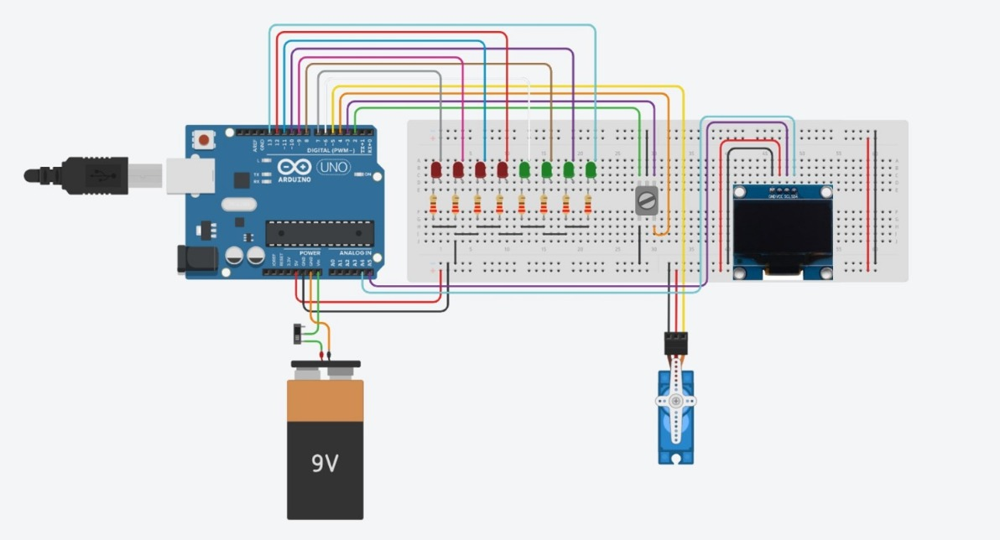
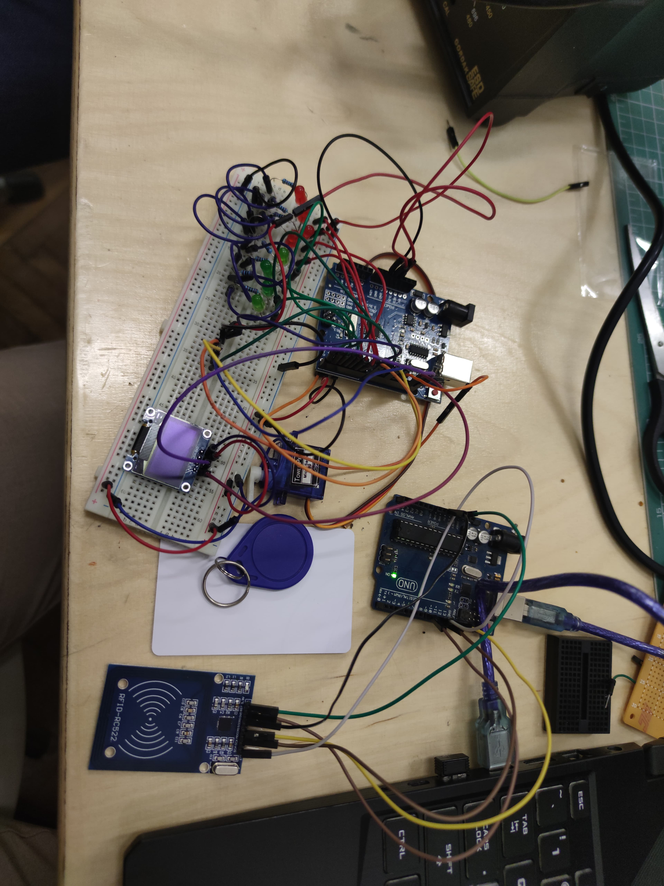

# DIY Safe Box  

---

## Introduction  

**Project Name:** DIY Safe Box  
**Functionality:**  
An interactive safe that allows the user to guess a numeric combination displayed on a screen. Once the correct value is entered, a servo motor unlocks the safe mechanism.  

**Purpose:**  
To develop a simple security device based on knowledge of electronics, programming, and communication protocols.  

**Inspiration:**  
I wanted to make a safe and then I found a game made by someone and I wanted to do the same thing, but on my own. I will attach the video in the Resources paragraph.  

**Usefulness:**  
- **For us:** Practical understanding of protocols and hardware components.  
- **For others:** Inspiration for similar projects, use as an educational device, or as a personal security mechanism.  

---

## General Description  

**Block Diagram:**  

(To be added at a later stage of the project)

| **Modules**            | **Description** |  
|------------------------|-----------------|  
| **LCD** (I2C/SPI)      | Displays the guessed combination and status messages (e.g., "Wrong code!" or "Safe opened"). |  
| **Buttons**            | Allow the user to select and confirm the entered value. |  
| **Servo Motor**        | Controls the locking/unlocking mechanism of the safe. |  
| **Microcontroller**    | Coordinates the operation of components by managing PWM, interrupts, and communication. |  
| **LEDs**               | Indicate correct numbers and their positions during guessing. |  
| **RFID Reader**        | Provides an additional method for safe access by scanning RFID cards. |  
| **Switch**             | Turns the safe on and off, initializing and resetting the game. |  

All components interact through the microcontroller, which handles the application logic and communication between hardware and software.  

---

## Hardware Design  

**Components List:**  
- Microcontroller (e.g., Arduino Uno)  
- LCD Display  
- Buttons (increment/confirm)  
- LEDs (for feedback on guesses)  
- RFID Reader Module  
- Servo Motor (e.g., SG90)  
- Resistors  
- Jumper wires  
- Breadboard or PCB for circuit assembly  
- Power supply (e.g., battery or USB)  
- Switch (for turning the safe on and off)
- 
**Block Diagram**


**Circuit Diagram:**  
  

**Physical Circuit (without box)**
 

**Signal Diagrams:**  
- PWM signal for servo motor control.  
- Protocol for communication between the microcontroller and LCD.  

**Simulation Results:**  
Images or screenshots from Tinkercad showcasing circuit functionality will be included.  

---

## Software Design  

**Description:**  
- **Development Environment:** Arduino IDE.  
- **Libraries Used:**  
  - `(to be decided)` for LCD communication (I2C or SPI).  
  - `Servo.h` for servo motor control.  
  - `MFRC522.h` for RFID reader functionality.  

**Algorithms and Structures Implemented:**  
1. **Interrupt Handling:** To detect button presses and manage input actions.  
2. **PWM Generation:** To control the servo motor for locking/unlocking the safe.  
3. **Communication Protocols:** To display values and messages on the LCD.  
4. **LED Feedback Logic:** To light up LEDs based on the correctness of guessed numbers and positions.  
5. **RFID Access Management:** To authenticate users via RFID cards and unlock the safe.  

**(Stage 3):** The complete source code will be included with detailed explanations of key functions and implementation details.  

---

## Flow  

1. **Turning the Safe On:**  
   - The switch is turned on, and a message is displayed on the LCD ("Welcome to the Safe Box!").  
   - The game begins, and the player can start guessing the combination.  

2. **Guessing the Combination:**  
   - The player enters a combination using the buttons.  
   - LEDs indicate the number of correct digits and their positions.  
   - The process continues until the correct combination is entered.  

3. **RFID Access:**  
   - If the player has an RFID card, the safe can be opened immediately by scanning the card.  
   - Once the safe is opened via RFID, the door is closed, and the game restarts with a new combination to guess.  

4. **Safe Turned Off:**  
   - If the switch is turned off, the safe is powered down and the game is reset, starting over with a new combination to guess.  

5. **Completion of the Game:**  
   - Once the correct combination is entered, the servo motor unlocks the safe, and a message is displayed on the LCD ("Safe Opened!").  
   - After the game is finished, the availability LED turns green, indicating the system is idle and ready to start a new game when the switch is turned on again.  

---

## Resources  

https://www.youtube.com/watch?v=33jPNMU3N5Q  

## Results  

1. A functional safe box system that integrates multiple components such as LEDs, LCD, servo motor, buttons, and an RFID reader.  
2. Successful implementation of multiple communication protocols (PWM for servo, I2C/SPI for LCD, RFID functionality).  
3. An educational project that applies knowledge from at least five laboratory exercises and demonstrates a practical use case for learned concepts.  
```
